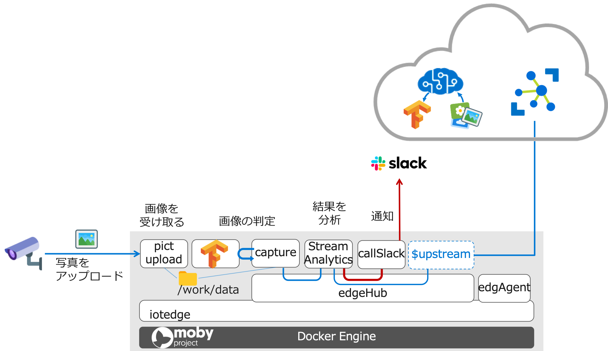

How to build:
==============================================

docker build -t <your image name> .

How to run locally:
==============================================
docker run -p 127.0.0.1:80:80 -d <your image name>

Then use your favorite tool to connect to the end points.

POST http://127.0.0.1/image with multipart/form-data using the imageData key
e.g
	curl -X POST http://127.0.0.1/image -F imageData=@some_file_name.jpg

POST http://127.0.0.1/image with application/octet-stream
e.g.
	curl -X POST http://127.0.0.1/image -H "Content-Type: application/octet-stream" --data-binary @some_file_name.jpg

POST http://127.0.0.1/url with a json body of { "url": "<test url here>" }
e.g.
    curl -X POST http://127.0.0.1/url -d '{ "url": "<test url here>" }'

For information on how to use these files to create and deploy through AzureML check out the readme.txt in the azureml directory.


# Edge Module




## エッジデバイスで動かすモジュール

### Custom Vision on Edge

Azure IoT Edgeのマニュアルにしたがって作成した、画像を識別するモデルとそれを呼び出すアプリケーション。

https://docs.microsoft.com/ja-jp/azure/iot-edge/tutorial-deploy-custom-vision

#### CameraCapture
Azure IoT EdgeのHostPathから画像データを読み込み、Classfiyアプリケーションを呼び出す。

#### Classify
受信した画像データの検証を Custom Vision で作成したモデルを利用して行い、検証結果をAzure IoT Hubに送信する。

### PictUploader
選択したファイルをアップロードするためのWebApp。

### SlackFunc
スラックにメッセージを送信するためのFunction App。
VSCodeのテンプレートをちょっと変更しただけ。SlackのWebhook URL は利用する環境に合わせて変更する。
C#なので、Pythonに変更したい。。。

## エッジデバイスへのデプロイ

### Azure のサービスのデプロイ

IoT Hub, Azure Stream Analytics on Edge をデプロイする。

### IoT Edge デバイス側の準備
* コンテナからHostPathでマウントするディレクトリ( /work/data ) を作成。chmod 777 に変更
* AzureのVMを利用する場合は、Inboundのポートとして 80 を許可

### モジュールの準備
各モジュールのディレクトリにあるmodule.jsonを、自分の利用する環境に合わせて編集する。

対象のファイルは、次の4つ。
* CVSolustion/module/slackFunc/module.json
* CVSolustion/module/cameraCapture/module.json
* CVSolustion/module/classifier/module.json
* CVSolustion/module/pictuploader/module.json

5行目は、DockerレジストリのURIになっていて Build & Push のプロセスで参照される。また、レジストリの情報はエッジデバイスにコンテナをデプロイするときにも参照される。

サンプル：cameraCapture/module.json
```
1	{
2	  "$schema-version": "0.0.4",
3	  "description": "",
4	  "image": {
5	    "repository": "akubicharm/cameracapture",
6	    "tag": {
7	      "version": "0.0.4",
8	      "platforms": {
9	        "amd64": "./Dockerfile.amd64",
10	        "amd64.debug": "./Dockerfile.amd64.debug",
11	        "arm32v7": "./Dockerfile.arm32v7"
12	      }
13	    },
14	    "buildOptions": []
15	  },
16	  "language": "python"
17	}
```

### slackfunc の編集

#### Slack の準備

1.  `https://slack.com/intl/ja-jp/create` にアクセスして、Slack のワークスペースを作成

2. 　SlackのApp メニューから`Incoming webhook` をインストール

3. Webhook URL をコピー

#### slackfunc の編集
`CVSolution/modules/slackFunc/slackFunc.cs` のWEBHOOK_URLの値をコピーした Webhook URL に変更

### デプロイメント・マニフェストの準備

1. VSCodeでAzureにログイン

2. VSCode のコマンドパレットで `>Azure IoT Edge: Add IoT Edge Module` と入力

3. デプロイマニフェストファイルを選択

4. Module テンプレートとして Azure Stream Anaytics を選択

5. モジュール名を入力
　＊ルーティングの設定に合わせて`asaonedge`とする＊

6. モジュールのデプロイ対象となる Azure Stream Analytics on Edge を選択

そうすると、`deployment.template.json` にAzureポータル画面で設定したクエリなどを取得するための情報が追加される。

deployment.template.json に追加された例
```
"asaonedge": {
	"properties.desired": {
		"ASAJobInfo": "https://XXX.blob.core.windows.net/asaonedge/ASAEdgeJobs/xxxxxxxxx-xxxx-xxxx-xxxx-xxxxxxxxxxxx/xxxxxxxx-xxxx-xxxx-xxxx-xxxxxxxxxxxx/ASAEdgeJobDefinition.zip?sv=2018-03-28&sr=b&sig=xxxx&st=2019-04-24T06%3A19%3A03Z&se=2022-04-24T06%3A29%3A03Z&sp=r",
		"ASAJobResourceId": "/subscriptions/xxxxxxxx-xxxx-xxxx-85b2-xxxxxxxxxxxx/resourceGroups/hpe/providers/Microsoft.StreamAnalytics/streamingjobs/hpeedge",
		"ASAJobEtag": "xxxxxxxx-xxxx-xxxx-xxxx-xxxx-xxxxxxxxxxxx",
		"PublishTimestamp": "4/24/2019 6:29:03 AM"
	}
}
```

### アプリケーションの実行
http://IoTEdgeデバイスのホスト名/upload にアクセスし、写真をアップロード。


### VSCodeからのデプロイ
1. VSCodeで、CVSolution プロジェクトを開く
2. deployment.template.json 右クリックして [Build and Push IoT Edge Solusion] を実行する
3. config/deployment.json ができていいることを確認する
4. VSCodeでAzureにログインして、デプロイ対象のIoT Hubを選択する（コマンドパレットで実行）
5. デプロイ対象のIoT Edgeデバイスを右クリックして、[Create Deployment for Single Device]をクリックする
6. config/deployment.json を指定してデプロイ
